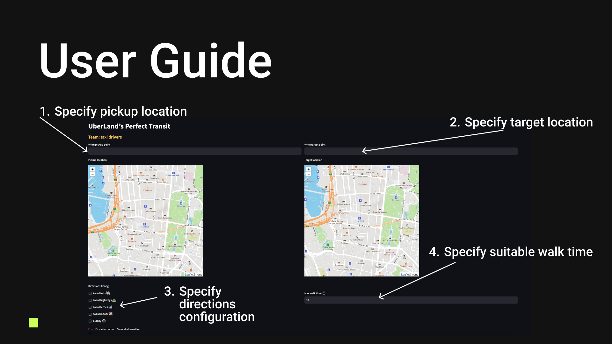
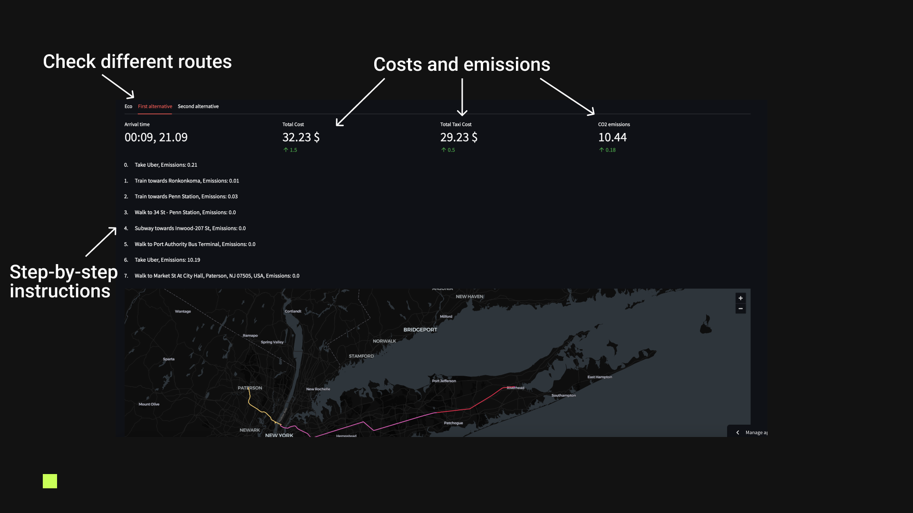

# UberLand's Perfect Transit

## How to run locally

To get started, clone the repository:
```
git clone https://github.com/advpropsys/uber.git
cd uber
```

Create a virtual environment and install the required libraries (Python 3.10.12):
```
python -m venv venv
venv/bin/activate
pip install -r requirements.txt
```

## User Guide



To run the application locally:

```
streamlit run app.py
```

DISCLAIMER
Currently, we are utilizing test data for emissions and regional pricing, but in the future, these data sources can be replaced with information collected from UberLand.
